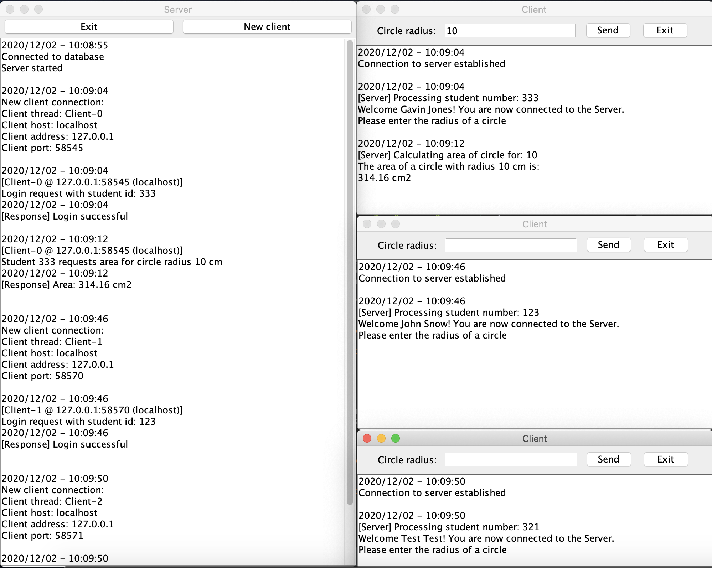
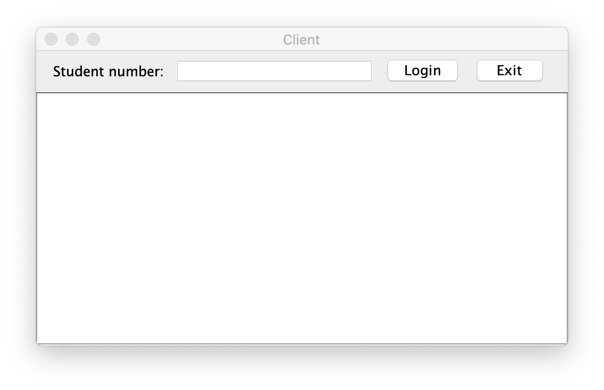
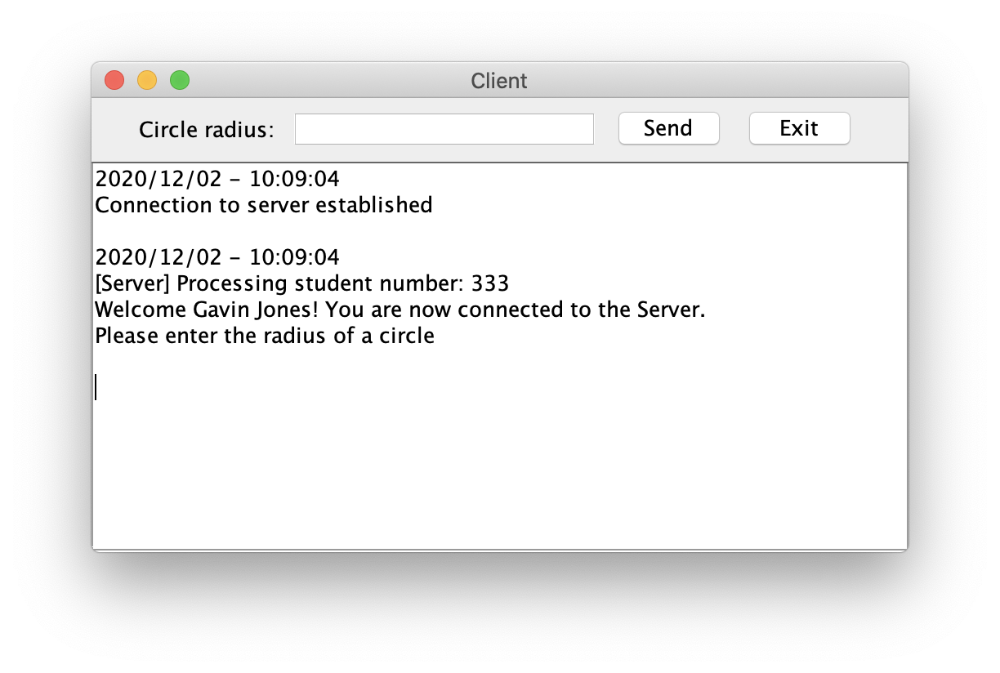
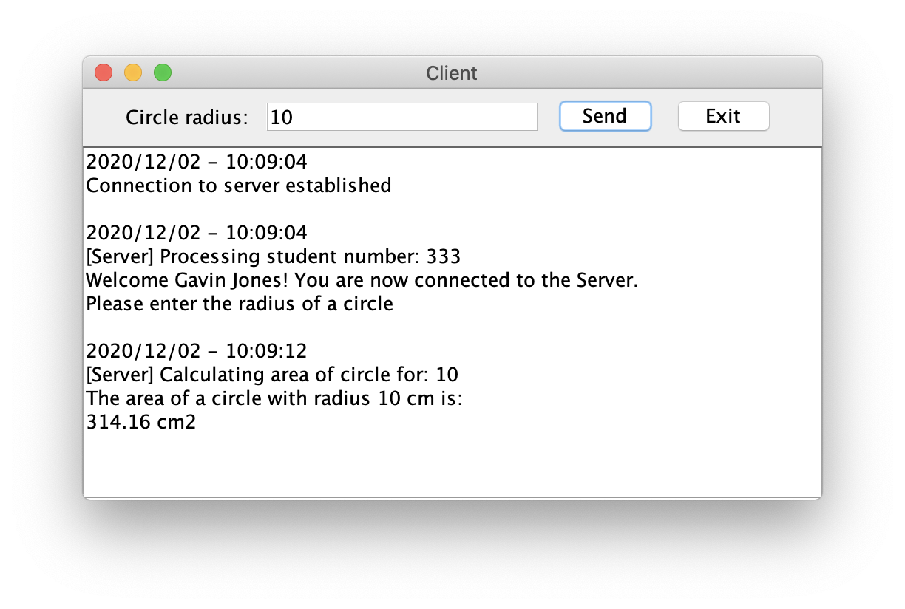
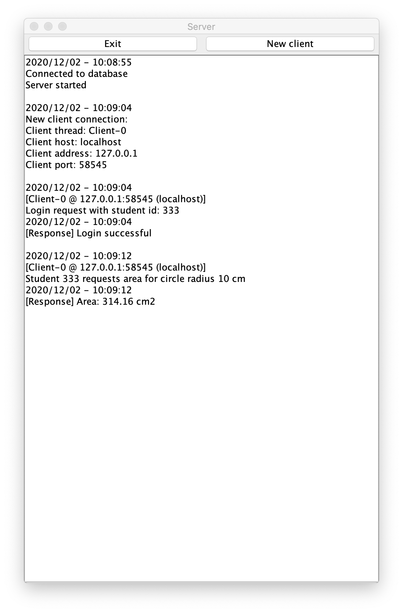
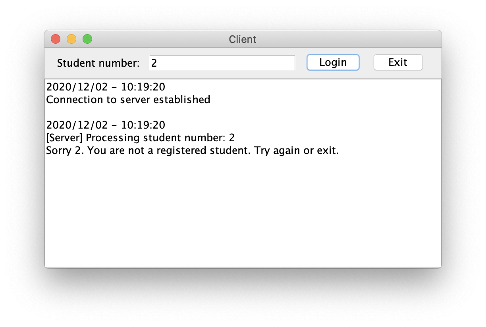
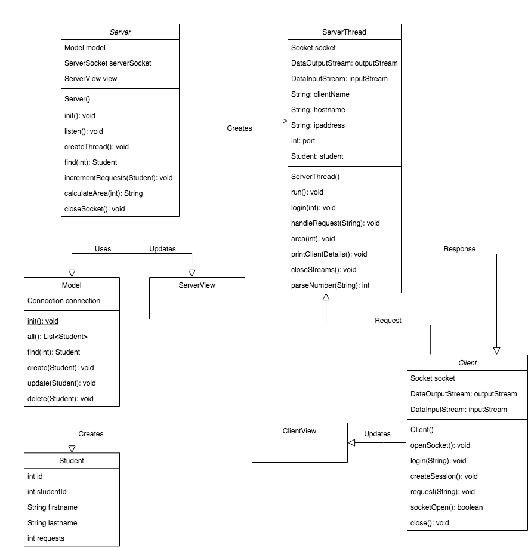

# MultiThreadedServer

Distributed systems assignment 2
The repo for this project can be found on
https://github.com/kingsleyzissou/MultiThreadedServer.

## Description

This app is a mutlithreaded client/server app. Each new client opens up a new thread on the server and communicates to the server via sockets. Only authenticated students can make requests to the server for the calculation of the area of a circle. 

## NB

My local database forced me to create a password for the database connection,
otherwise connection to the database was refused. I have set the password to `root`.

Please modify the password field in the `core/DBConnection` class as required.

## Usage

To be able to send a request to the server to calculate the area of the circle, you need to be logged in. Enter the login details in the textfield provided. Once logged in, you will see a welcome message and the texfield has changed to accept input for the radius of a circle.

You can now enter in the radius of the circle and a request will be sent to the server through a socket connection, the response will be printed in the client GUI.

All events from the various clients are logged to the server, with the client name, the ip address and the host name of the client, along with the timestamps of the given request.

## Error Handling

A student not in the database will not be authenticated and will not be taken to the screen where they can make requests to the server for the area of a circle.

## Architecture

The project makes use of an MVC approach for the client and the server. The server is responsable for updating the server view and the client is responsable for the client view. The model is used to retrieve student information from the database. 

New threads are created from the server when a socket is opened from a new client.

The class diagram can be seen below

